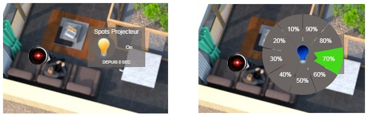
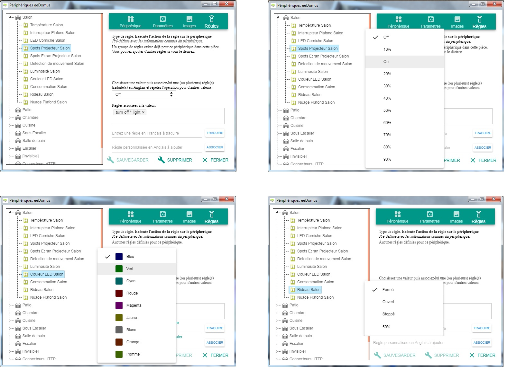

# eeDomus

Ce plugin est un add-on pour le framework [Avatar](https://spikharpax.github.io/A.V.A.T.A.R/).

Ce plug-in vous permet d'afficher et de contrôler vos périphériques en mode Plan directement dans l'interface A.V.A.T.A.R.

Les possibilités de personnalisation des widgets sont grandes, vous pouvez intervenir sur différentes propriétés des widgets:
* La couleur du fond
* La couleur des textes
* La transparence
* La dimension de la bordure
* La taille de la police du titre
* La taille de la police de la valeur
* La taille de la police du status
* Le décalage de la position du texte du status
* L'image pour les différents états
* La taille de l'image
* Tester les modifications sans sauvegarder
* Sauvegardez les modifications pour le widget sélectionné ou pour tous les widgets

### _Définissez des règles vocales pour tous vos périphériques et toutes leurs valeurs sans aucun développement et en 2 minutes !_

Et encore plein d'autres choses !

Le portage du plug-in pour une autre box domotique est possible. Téléchargez le plug-in et suivez la documentation pour savoir comment faire.

***
## ★ Installation
* Téléchargez le projet depuis la bibliothèque de plug-ins A.V.A.T.A.R

***
## ★ Configuration et utilisation
* Ouvrez le Plug-in Studio A.V.A.T.A.R
* Cliquez sur l'icône du plug-in eeDomus
* Dans son menu déroulant, cliquez sur _Documentation_

 

## Versions
Version 2.0
- Version Released
