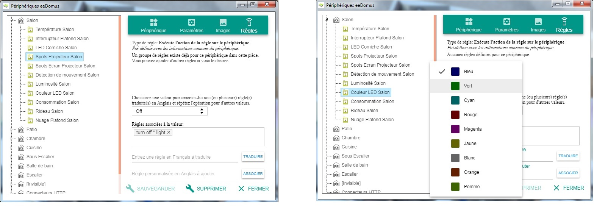

# eeDomus

Ce plugin est un add-on pour le framework [A.V.A.T.A.R](https://spikharpax.github.io/A.V.A.T.A.R/).

Ce plug-in vous permet d'afficher et de contrôler vos périphériques en mode Plan directement dans l'interface A.V.A.T.A.R.

Tous les types de périphérique sont gérés (capteurs et actionneurs) et tous les widgets sont bidirectionnels, ils envoient les ordres de changement de valeurs et reçoivent les informations des périphériques pour les afficher.

Choisissez simplement le périphérique, les valeurs que vous voulez gérer pour le mode intérrupteur et optionnellement celles que vous voulez voir apparaitre dans le menu circulaire et cliquez sur "Créer". C'est tout !

Mais ce n'est pas tout, ce plug-in vous permet aussi de définir des règles vocales pour tous vos périphériques et toutes leurs valeurs et **sans aucun développement !**.

Et encore plein d'autres choses !

Le portage du plug-in pour une autre box domotique est possible. Téléchargez le plug-in et suivez la documentation.

***
## ★ Installation
* Téléchargez le projet depuis la bibliothèque de plug-ins A.V.A.T.A.R

**Compatibilité:** A.V.A.T.A.R Serveur >= 3.4

***
## ★ Configuration et utilisation
* Ouvrez le Plug-in Studio A.V.A.T.A.R
* Cliquez sur l'icône du plug-in eeDomus
* Dans son menu déroulant, cliquez sur _Documentation_

***
## Historique
* Version 2.0 (09-06-2020):
    * Nouvelle version, mode Plan, widgets et règles
* Version 1.0 (01-02-2018):
    * Démonstrateur

***
## ★ License
Logiciel libre sous [licence MIT](https://github.com/Spikharpax/A.V.A.T.A.R/blob/master/LICENSE)

Copyright (c) 2020 A.V.A.T.A.R - Stéphane Bascher
